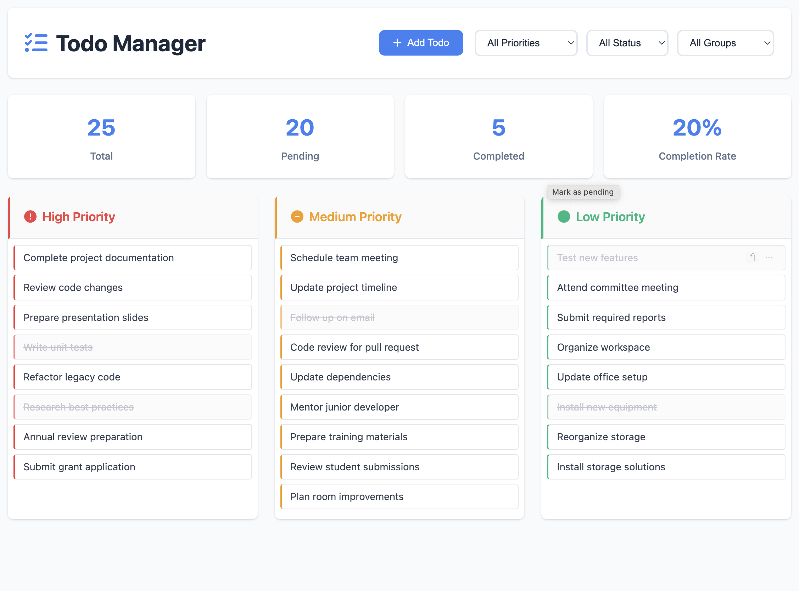

# Todo Manager

🚀 **[Live Demo](https://kylemath.github.io/todo)** 🚀

A modern todo application with persistent storage options (database or localStorage).

## Quick Start (GitHub Pages / Static Hosting)

The app works perfectly as a static site! Simply:

1. **Open directly in browser**: Open `index.html` in your browser
2. **Or deploy to GitHub Pages**:
   - Push this repo to GitHub
   - Go to Settings → Pages
   - Select your branch and `/ (root)` folder
   - The app will work using localStorage (no server needed!)

The app automatically falls back to localStorage when no server is available, so it works great for static hosting.

## Local Development with Database (Optional)

For local development with SQLite database persistence:

1. **Install Node.js**:
   ```bash
   # Install Node.js from https://nodejs.org/ or using Homebrew:
   brew install node
   ```

2. **Install Dependencies**:
   ```bash
   npm install
   ```

3. **Start the Server**:
   ```bash
   npm start
   ```

4. **Access the App**:
   Open http://localhost:3000 in your browser

## Features

- ✅ Drag & drop todos between priority columns
- ✅ Minimal, distraction-free design
- ✅ SQLite database persistence (local development)
- ✅ localStorage fallback (works without server)
- ✅ Real-time stats tracking
- ✅ Filtering and grouping
- ✅ Priority-based organization
- ✅ Group categorization

## Storage

- **With Server**: Uses SQLite database (`todos.db`) for persistence
- **Without Server**: Automatically uses browser localStorage
- **Note**: The database file (`todos.db`) is excluded from git via `.gitignore` to protect your personal data

## API Endpoints (Server Mode Only)

- `GET /api/todos` - Get all todos
- `POST /api/todos` - Create a new todo
- `PUT /api/todos/:id` - Update a todo
- `DELETE /api/todos/:id` - Delete a todo
- `POST /api/todos/bulk` - Bulk insert todos

## Privacy Note

This repository contains only the application code with generic sample data. Your personal todos are stored locally in your browser's localStorage or in a local database file that is not committed to the repository.


## Preview

<p align="center">
  
</p>

